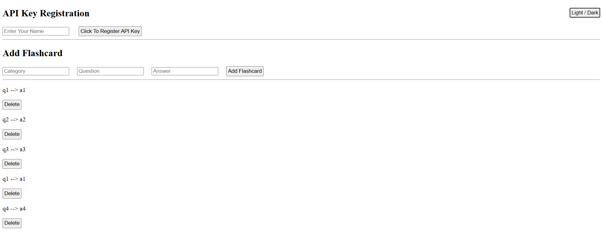

# Resolution Python Week 5
I created a front end for my flashcard api. You can create and delete you flashcards. You can also see the question and the answer to the flashcard. However you will need to register your API using the text entry and button at the top. You'll need to have an API key in order to create and delete flashcards. Also if you don't like the light mode, you can click the button on the top right to switch over to dark mode.

You can install it here: https://test.pypi.org/project/resolution-week5-Asurant/

